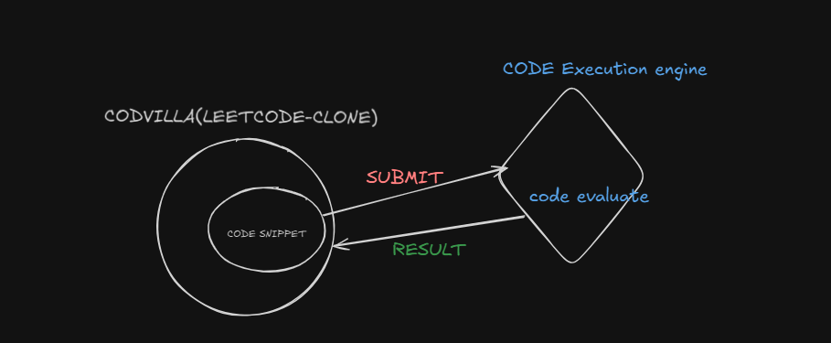

                                                     #CODVILLA
# Codvilla
Codvilla is a platform for developers to showcase their coding skills through various challenges and competitions.
# Features
- **User Profiles**: Create and manage your profile.
- **Challenges**: Participate in coding challenges and contests.
- **Leaderboard**: Track your progress and compare with others.
- **Discussion Forums**: Engage with the community through forums.
- **Code Reviews**: Get feedback on your code from peers.
# Installation
1. Clone the repository:
   ```bash
   git clone
2. Navigate to the project directory:
   ```bash
   cd codvilla
   ```
3. Install dependencies:
   ```bash  
    npm install
    ```
4. Start the development server:
    ```bash
    npm start
    ```

# Contributing
We welcome contributions! Please read our [CONTRIBUTING.md](CONTRIBUTING.md) for details on how to get started.

# THE CODVILLA  SOLUTION CHEKING LOGIC 

 
 # To learn more about the Codvilla solution checking logic and process of building end to end go through below link
[Codvilla](https://www.youtube.com/live/t1QzdeUzxXI?si=9zb9bxJYviUKqptO) @harkirat singh
[Codvilla](https://youtu.be/GnodscC2p-A?si=sOs0jyvvWTL51wLC) @freecodecamp
